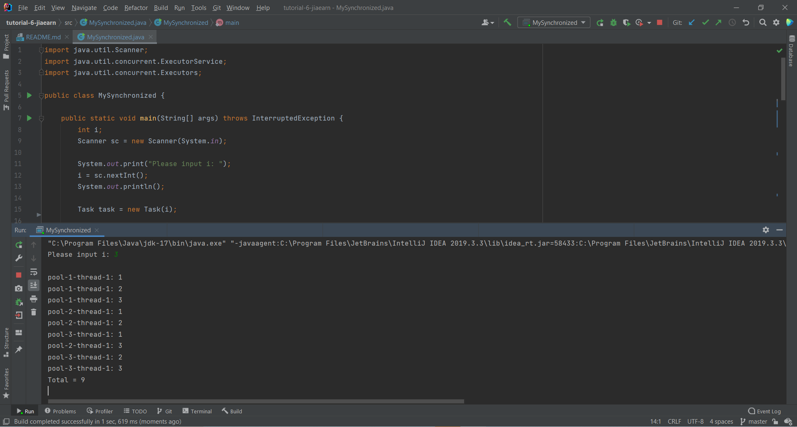

## Your Info:
1. Matric Number: 269509
2. Name: Tan Jia Earn


## Instruction:

1. Study the code and watch the video below:

   * https://github.com/zhamri/STIW3054-RT-Programming/blob/master/src/Week_06/TestSynchronized2s1.java  
   * [Java Thread | 3 ways to implement ExecuterService with SingleThreadExecuter Example](https://youtu.be/P6Ytrr3CG9M)

2. Modify the code by applying ExecuterService with SingleThreadExecuter.

3. The variable `i` is integer number and MUST be input from the keyboard.

4. The program file which has the main method should be named `MySynchronized.java` and place in the `src` folder.

5. Screenshot the result and upload to this repo too.

6. Watch the video to clone, add, commit and push a repository to GitHub: https://youtu.be/RXV3Yusr0SI

## Example of the output
```
Please input i: 3

pool-1-thread-1: 1
pool-3-thread-1: 1
pool-3-thread-1: 2
pool-3-thread-1: 3
pool-2-thread-1: 1
pool-2-thread-1: 2
pool-2-thread-1: 3
pool-1-thread-1: 2
pool-1-thread-1: 3
Total = 9
```

## Your Output/Result


